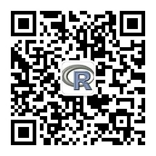

# 数据人Python语言数据处理

这个教程汇集如何利用Python语言对数据做处理和整合，从而形成可以用于做数据分析或者模型的数据。

数据人的学习，分享和交流平台可以访问[**数据人网**](http://shujuren.org)，数据人网提供和传播优质的数据知识，包括数据思想，数据工具，数据方法和数据框架。每个数据人都可以在这个平台上面找到自己感兴趣的内容，同时，这个平台也能够让每个人参与创造和分享自己的数据知识，营造一个**知识盈余**的场所。数据人网也推出了两个公众号，一个是**R语言**，另一个是**数据科学与人工智能**。

**R语言**公众号，分享和传播R语言的知识，欢迎关注。

**数据科学与人工智能**公众号，分享和传播数据科学与人工智能的内容，欢迎关注。

## 内容提纲

1. 数据导入和导出
    - 数据导入
    - 数据导出

2. Pandas库做数据处理
    - Pandas使用

## 其它福利

数据人Python语言其它主题。

1. 数据可视化
2. 机器学习([file](https://github.com/wangluqing/shujuren_Python/tree/master/3machine_learning/))
3. 数据项目([file](https://github.com/wangluqing/shujuren_Python/tree/master/4data_project/))

**开始时间**:2018年1月1日
